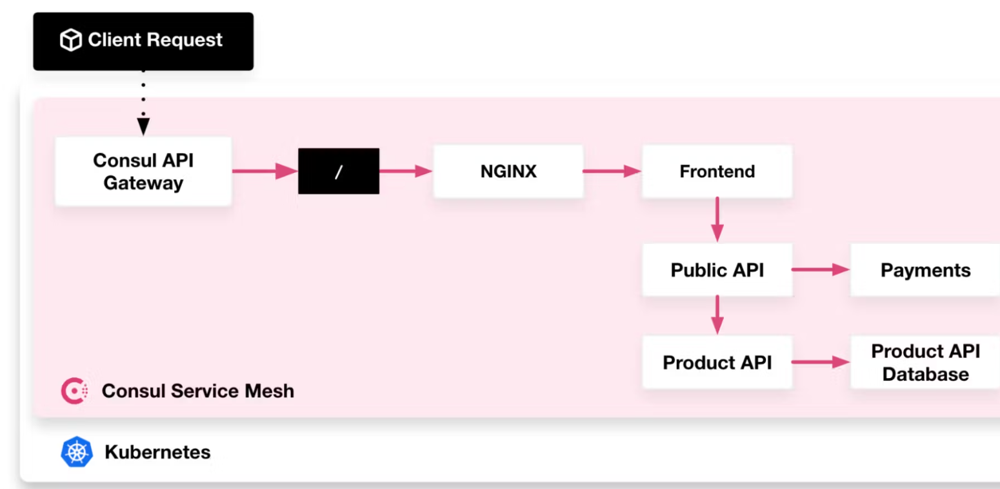

Documentation for this chart in progress...

## Helm Chart Repository for Consul API Gateway 

In this Helm Chart, you will enable external access into your service mesh by deploying a 
Consul API Gateway. Consul API Gateway provides a consistent method to handle inbound
requests and route them to the appropriate service within your service mesh.

